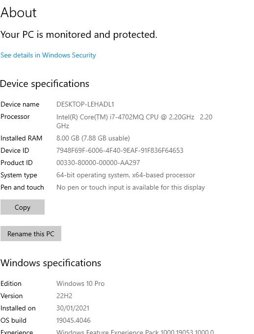

# Dev_Setup
Setup Development Environment

#Assignment: Setting Up Your Developer Environment

#Objective:
This assignment aims to familiarize you with the tools and configurations necessary to set up an efficient developer environment for software engineering projects. Completing this assignment will give you the skills required to set up a robust and productive workspace conducive to coding, debugging, version control, and collaboration.

#Tasks:

1. Select Your Operating System (OS):
   Choose an operating system that best suits your preferences and project requirements. Download and Install Windows 11. https://www.microsoft.com/software-download/windows11
   
   Step-by-Step Process for Downloading and Installing Windows 10
Step 1: Check System Requirements
Before downloading, ensure your computer meets the minimum system requirements for Windows 10.

Processor: 1GHz or faster
RAM: 1GB for 32-bit or 2GB for 64-bit
Hard disk space: 16GB for 32-bit OS or 20GB for 64-bit OS
Graphics card: DirectX 9 or later with WDDM 1.0 driver
Display: 800x600
Step 2: Backup Your Data
It's important to back up your files to an external drive, cloud storage, or another backup solution.

Step 3: Download the Windows 10 Media Creation Tool
Visit the Microsoft Download Windows 10 page.
Click on "Download tool now" to download the Media Creation Tool.
Step 4: Run the Media Creation Tool
Open the downloaded Media Creation Tool file (MediaCreationTool.exe).
Accept the license terms.
Step 5: Choose Your Installation Option
Upgrade this PC now: If you are upgrading the current PC.
Create installation media (USB flash drive, DVD, or ISO file) for another PC: If you want to create installation media.
Step 6: Create Installation Media
Select "Create installation media" and click "Next".
Choose the language, edition, and architecture (32-bit, 64-bit, or both).
Select the media you want to use:
USB flash drive: At least 8GB.
ISO file: Save an ISO file to burn to a DVD later.
Step 7: Install Windows 10
Insert the USB flash drive or DVD with the Windows 10 installation files into your PC.
Restart your PC and boot from the USB drive or DVD (you might need to change the boot order in your BIOS settings).
Follow the on-screen instructions to install Windows 10.

2. Install a Text Editor or Integrated Development Environment (IDE):
   Select and install a text editor or IDE suitable for your programming languages and workflow. Download and Install Visual Studio Code. https://code.visualstudio.com/Download
   Step 1: Download Visual Studio Code
Open your web browser and go to the Visual Studio Code website.
Click on the "Download" button for your operating system (Windows, macOS, or Linux).
Step 2: Install Visual Studio Code on Windows
For Windows:
Once the download is complete, open the downloaded file (VSCodeSetup-x.x.x.exe).
In the setup window, accept the agreement and click "Next".
Choose the destination folder where you want to install VS Code and click "Next".
Select additional tasks if needed (e.g., creating a desktop icon, adding VS Code to PATH for the command line) and click "Next".
Click "Install" to start the installation.
Once the installation is complete, click "Finish" to launch Visual Studio Code.

3. Set Up Version Control System:
   Install Git and configure it on your local machine. Create a GitHub account for hosting your repositories. Initialize a Git repository for your project and make your first commit. https://github.com

   Step 1: Install Git
   Step 2: Configure Git
Open a terminal (or Git Bash on Windows).

Set your username:
git config --global user.name "Your Name"
Set your email:
git config --global user.email "your.email@example.com"

Step 3: Create a GitHub Account
Go to GitHub: Visit GitHub's signup page.
Sign Up: Follow the instructions to create a new account.

Step 4: Create a New Repository on GitHub
Log In to GitHub: Go to GitHub and log in.
Create a New Repository:
Click on the "+" icon in the top-right corner and select "New repository".
Fill in the repository name, description (optional), and choose its visibility (public or private).
Click "Create repository".

Step 5: Initialize a Git Repository Locally
Open a Terminal (or Git Bash on Windows).
Navigate to your project directory:
cd path/to/your/project

Initialize the Git Repository:
git init

Add Files to the Repository:
git add .
Make the First Commit:
git commit -m "Initial commit"

On Windows:
Download Git: Go to the Git for Windows download page and download the latest version of Git.
Run the Installer: Open the downloaded .exe file and follow the installation instructions. Use the default settings unless you have specific preferences.

4. Install Necessary Programming Languages and Runtimes:
  Instal Python from http://wwww.python.org programming language required for your project and install their respective compilers, interpreters, or runtimes. Ensure you have the necessary tools to build and execute your code.

To install the necessary programming languages and runtimes, you will need to follow these steps. This guide focuses on Python as an example.

Step-by-Step Guide to Installing Python
Visit the Python Website:

Go to the official Python website: python.org.
Download Python Installer:

On the Python homepage, click on the "Downloads" menu.
The website will usually detect your operating system automatically and recommend the appropriate version. For example, you will see a button labeled "Download Python 3.x.x" (where 3.x.x is the latest version).
Click this button to download the installer.
Run the Installer:

Locate the downloaded installer file (it should be in your Downloads folder).
Double-click the installer to run it.
Follow the Installation Wizard:

Windows:
When the installer window opens, make sure to check the box that says "Add Python to PATH". This is important for running Python from the command line.
Click "Install Now" or customize the installation if you need specific settings.

Verify the Installation:
Open a command prompt or terminal.
Type python --version or python3 --version to check the installed version of Python.
You should see a response indicating the installed Python version, such as Python 3.x.x.

5.To install pip, the package manager for Python, you can follow these steps:

For Python 3.4 and later
Python 3.4 and later versions include ensurepip, a module that can be used to install pip. You can run the following command in your terminal or command prompt:

python -m ensurepip --upgrade
For Python 2.7.9 and later

For Python 2.7.9 and later versions, pip is already bundled with the installation. However, if you need to upgrade pip or install it manually, you can use:
python -m ensurepip --upgrade

Installing pip for older versions of Python or if pip is not available
If you have an older version of Python, or if for some reason pip is not installed, you can manually install it using the following steps:

Download the get-pip.py script from the official source: https://bootstrap.pypa.io/get-pip.py

Run the script with Python:

python get-pip.py
Verifying Installation

To verify that pip has been installed correctly, you can check the version by running:

pip --version
This command should display the installed version of pip.

Additional Package Managers
Depending on your needs, you might also want to install other package managers:

conda: A package manager that comes with Anaconda and Miniconda distributions, used for managing Python and R packages and environments.

To install Miniconda (a minimal installer for conda):

Download the installer for your operating system from https://docs.conda.io/en/latest/miniconda.html
Run the installer and follow the instructions.

These package managers can help you manage your software dependencies and environment more effectively.

6. To configure and install MySQL 5.7 on a Windows machine, follow these steps:

Step 1: Download MySQL Installer
Go to the MySQL downloads page.
Choose the appropriate installer for your system (e.g., the web community installer if you prefer a smaller initial download).
Click "Download".

Step 2: Install MySQL
Run the Installer: After downloading, run the installer.
Choose Setup Type: Select the setup type. For most users, "Developer Default" is recommended. This includes the MySQL server, MySQL Workbench, and other useful tools.
Install Requirements: The installer will check for necessary software (like Visual Studio Redistributable). If needed, follow the prompts to install these prerequisites.
Installation: Click "Execute" to begin the installation of MySQL components.

Step 3: Configure MySQL
Type and Networking: Choose the default configuration. For the port number, 3306 is standard.
Authentication Method: Use the recommended method for your situation. Typically, the default (caching SHA2 password) is fine.

Accounts and Roles: Set a password for the MySQL root account. You can also create additional user accounts here.
Windows Service: Configure MySQL to run as a Windows service. Keep the default service name (MySQL57) and ensure it is set to start the service automatically.

Step 4: Apply Configuration
Execute Configuration: Click "Execute" to apply the configuration settings. The installer will start the MySQL server and apply your configurations.

Step 5: Complete Installation
Finish: Once the configuration is complete, click "Finish".

Step 6: Verify Installation
MySQL Workbench: Open MySQL Workbench, which should have been installed as part of the default setup.
Connect to Database: Use the root account credentials to connect to your MySQL server to verify everything is working.

Step 7: Secure Installation (Optional)
Run Security Script: Open a command prompt and navigate to the MySQL bin directory (usually C:\Program Files\MySQL\MySQL Server 5.7\bin).
Execute Secure Installation: Run the command mysql_secure_installation to further secure your MySQL installation by setting additional security options.

Popular VM Tools:
VMware
VirtualBox

Steps to Set Up a Virtual Machine:
Install Virtual Machine Software:

Download and install VirtualBox or VMware.
Create a New VM:

Open the VM software and create a new virtual machine.
Choose the desired operating system and allocate the required resources (CPU, RAM, Disk space).
Install the Operating System:

Attach an ISO file of the operating system you wish to install and boot the VM.
Follow the installation process for the OS.
Configure the VM:

Install necessary tools and software inside the VM (e.g., development tools, editors, libraries).
Snapshot and Clone:

Take snapshots of your VM to save the current state.
Clone VMs to create consistent environments for different projects or team members.

2. Docker
Docker allows you to package applications and their dependencies into containers. These containers can run consistently across various environments, making them ideal for development and deployment.

Steps to Set Up Docker:
Install Docker:

Download and install Docker from the official Docker website.
Ensure Docker is running on your machine.
Create a Dockerfile:

A Dockerfile is a text document that contains all the commands to assemble an image.
Example Dockerfile for a Python application:
dockerfile

# Use an official Python runtime as a parent image
FROM python:3.9-slim

# Set the working directory in the container
WORKDIR /app

# Copy the current directory contents into the container at /app
COPY . /app

# Install any needed packages specified in requirements.txt
RUN pip install --no-cache-dir -r requirements.txt

# Make port 80 available to the world outside this container
EXPOSE 80

# Define environment variable
ENV NAME World

# Run app.py when the container launches
CMD ["python", "app.py"]
Build the Docker Image:

Open a terminal and navigate to the directory containing your Dockerfile.
Run the following command to build the image:

docker build -t my-python-app .
Run the Docker Container:

Once the image is built, you can run it in a container:

docker run -p 4000:80 my-python-app
This command maps port 4000 on your host to port 80 in the container.
Docker Compose (Optional):

For multi-container applications, use Docker Compose to define and run multi-container Docker applications.
Example docker-compose.yml:
yaml

version: '3'
services:
  web:
    image: my-python-app
    ports:
      - "4000:80"
  redis:
    image: "redis:alpine"
Start the application with:

docker-compose up

8. Explore Extensions and Plugins:
   Explore available extensions, plugins, and add-ons for your chosen text editor or IDE to enhance functionality, such as syntax highlighting, linting, code formatting, and version control integration.

   
   Visual Studio Code (VS Code)

VS Code is known for its extensive marketplace of extensions. Here are some highly recommended ones:

Prettier - Code Formatter:

Automatically formats your code to ensure a consistent style.
Supports many languages and integrates with VS Code easily.
ESLint:

Integrates ESLint into VS Code.
Provides real-time linting and fixing for JavaScript and TypeScript.
GitLens:

Enhances the built-in Git capabilities.
Displays code authorship, commits, and file history.
Python:

Adds support for Python development.
Includes features like IntelliSense, linting, debugging, and Jupyter Notebooks.
Live Server:

Launches a local development server with live reload for static and dynamic pages.

Docker:

Adds support for Docker containers, including creating, managing, and debugging.
JetBrains IntelliJ IDEA
IntelliJ IDEA is a powerful IDE, especially for Java development. Here are some useful plugins:

CheckStyle-IDEA:

Integrates CheckStyle into IntelliJ IDEA.
Helps enforce coding standards and best practices.

Lombok:

Adds support for Project Lombok, which reduces boilerplate code in Java.

SonarLint:

Provides on-the-fly feedback to developers on code quality and security issues.

Rainbow Brackets:

Colors matching brackets for easier code navigation and readability.

Material Theme UI:

Offers a variety of beautiful themes for a more pleasant coding experience.
Sublime Text
Sublime Text is a lightweight yet powerful text editor. Here are some must-have packages:

Package Control:

Essential for managing other Sublime Text packages.

SublimeLinter:

A framework for linting code.
Supports various languages through additional plugins.

Emmet:

Speeds up HTML and CSS workflows with abbreviations.

GitGutter:

Shows git diff information in the gutter.

AutoPEP8:

Automatically formats Python code to conform to the PEP 8 style guide.

Atom
Atom is a highly customizable text editor. Here are some popular packages:

linter:

Provides a base linter framework.
Requires additional language-specific linters.

atom-beautify:

Beautifies code in many languages.

minimap:

Adds a preview of the entire file on the right-hand side.

git-plus:

Adds git integration for basic git operations from within Atom.

Hydrogen:

Brings Jupyter-like functionality to Atom, allowing you to run code interactively.

How to Explore and Install Extensions
For each of these editors and IDEs, the process to explore and install extensions is straightforward:

VS Code: Use the Extensions view (Ctrl+Shift+X) to search for and install extensions from the Marketplace.
IntelliJ IDEA: Use the Plugin Manager from File > Settings > Plugins to browse and install plugins.
Sublime Text: Install Package Control first, then use Ctrl+Shift+P and type Install Package to browse and install packages.
Atom: Use the Settings view (Ctrl+,), navigate to the Install tab, and search for packages.
By leveraging these extensions and plugins, you can tailor your development environment to fit your needs, improve productivity, and streamline your workflow.

9. Document Your Setup:
    Create a comprehensive document outlining the steps you've taken to set up your developer environment. Include any configurations, customizations, or troubleshooting steps encountered during the process. 

1. System Requirements
Ensure that your system meets the following minimum requirements:

Operating System: Windows 10
Processor: Intel Core i5 or equivalent.
Memory: 8 GB RAM.
Storage: 50 GB free disk space.
Internet Connection: Stable and fast internet connection for downloading tools and dependencies.
2. Installation Steps
2.1. Install Git
Windows:

Download Git from git-scm.com.
Run the installer and follow the on-screen instructions.
Verify installation by running git --version in Command Prompt.
macOS:

Open Terminal.
Install Git using Homebrew: brew install git.
Verify installation by running git --version.
Linux (Ubuntu):

Open Terminal.
Install Git: sudo apt-get update && sudo apt-get install git.
Verify installation by running git --version.

2.2. Install Node.js and npm
Windows and macOS:

Download Node.js from nodejs.org.
Run the installer and follow the on-screen instructions.
Verify installation by running node -v and npm -v in your terminal.Linux (Ubuntu):

2.4. Install Python
Windows:

Download Python from python.org.
Run the installer, check "Add Python to PATH," and follow the on-screen instructions.
Verify installation by running python --version in Command Prompt.

Open Terminal.
Install Python using Homebrew: brew install python.
Verify installation by running python3 --version.

2.5. Install Docker
Windows:

Download Docker Desktop from docker.com.
Run the installer and follow the on-screen instructions.
Launch Docker Desktop and follow the setup guide.

Verify installation by running docker --version.

3. Configuration and Customizations
3.1. Git Configuration
Set up your Git username and email:

git config --global user.name "Your Name"
git config --global user.email "you@example.com"
Generate SSH keys and add to GitHub/GitLab:

ssh-keygen -t rsa -b 4096 -C "your_email@example.com"
eval "$(ssh-agent -s)"
ssh-add ~/.ssh/id_rsa
cat ~/.ssh/id_rsa.pub

3.2. Visual Studio Code Extensions
Install the following extensions for an enhanced development experience:

Python
ESLint
Prettier - Code formatter
Docker
GitLens

4. Troubleshooting
4.1. Git Issues
Problem: Git command not found.
Solution: Ensure Git is installed and added to your system's PATH.

4.2. Node.js and npm Issues
Problem: npm command not found.
Solution: Ensure Node.js and npm are installed correctly. Reinstall if necessary.

4.3. Docker Issues
Problem: Docker daemon not running.
Solution: Start Docker daemon and ensure it is set to start on boot.

4.4. Python Issues
Problem: Python command not found.
Solution: Ensure Python is installed and added to your system's PATH. Use python3 if necessary.

#Deliverables:
- Document detailing the setup process with step-by-step instructions and screenshots where necessary.
- A GitHub repository containing a sample project initialized with Git and any necessary configuration files (e.g., .gitignore).
- A reflection on the challenges faced during setup and strategies employed to overcome them.

#Submission:
Submit your document and GitHub repository link through the designated platform or email to the instructor by the specified deadline.

#Evaluation Criteria:**
- Completeness and accuracy of setup documentation.
- Effectiveness of version control implementation.
- Appropriateness of tools selected for the project requirements.
- Clarity of reflection on challenges and solutions encountered.
- Adherence to submission guidelines and deadlines.

Note: Feel free to reach out for clarification or assistance with any aspect of the assignment.
